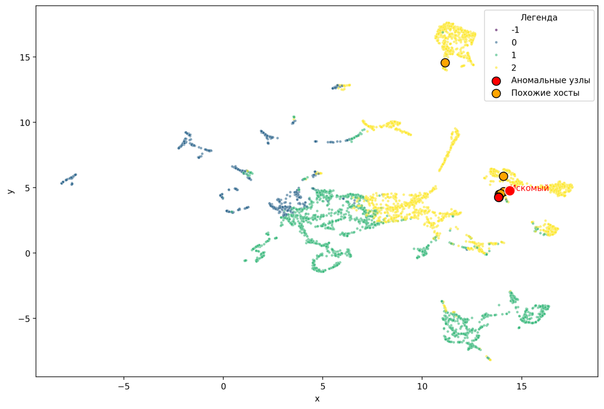
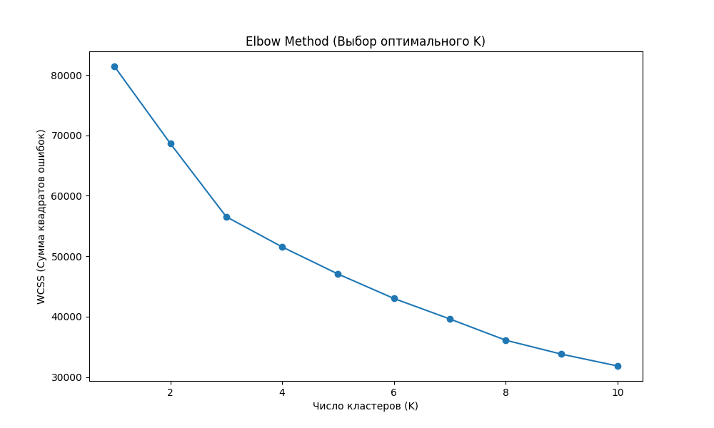

# Network Traffic Similarity Analyzer

Компонент системы Network Traffic Analysis для поиска похожих узлов корпоративной сети по характеру сетевых взаимодействий.

## Задача
Разработать систему, которая для заданного компьютера корпоративной сети находит наиболее похожие на него компьютеры по характеру сетевых взаимодействий на основе данных Network Flow. Важно не только получить список соседей, но и объяснить, почему эти компьютеры считаются похожими с точки зрения сетевого поведения.

## Данные
Использован открытый датасет LANL. Основной источник данных — flows.txt.gz (сетевые потоки). Для расширенной интерпретации и Threat Hunting интегрированы следующие дополнительные источники:
- auth.txt.gz (события аутентификации)
- dns.txt.gz (запросы DNS)
- proc.txt.gz (запуск и остановка процессов)
- redteam.txt.gz (индикаторы компрометации — реальные события атак)

Все данные обезличены. Хосты представлены в виде идентификаторов вида C101.

## Архитектура решения
Проект построен с использованием принципов ООП и разделения ответственности. Основной поток данных проходит через 4 модуля:

### 1. Feature Engineering (src/features_v2.py, src/features_v3.py, src/extra_analysis/build_extra_features.py)
- Очистка данных: удаление эфемерных портов (начинающихся с 'N').
- Построение профиля хоста: агрегация по источнику (суммарные байты, пакеты, длительность, энтропия по получателям, средний размер пакета).
- TF-IDF по портам: хост представляется как "документ", а порты как "слова". Это позволяет выявить, какие сервисы (например, SMB: 445, 139) использует хост.
- Интеграция дополнительных данных: DNS, Auth, Proc. Создание признаков (уникальные домены, количество пользователей, неудачные логины, процессы). Также из RedTeam извлекаются скомпрометированные хосты.

### 2. Предобработка и Кластеризация (src/make_ui_data.py, src/extra_analysis/elbow_method.py)
- Логарифмическая трансформация (Log1p) для сжатия тяжелых хвостов.
- TruncatedSVD: сжатие TF-IDF матрицы портов в 50 скрытых тем (борьба с «проклятием размерности»).
- UMAP: проекция многомерных векторов в 2D для визуализации.
- K-Means: разбиение хостов на кластеры по сетевым паттернам. Оптимальное количество кластеров выбрано с помощью метода локтя (Elbow Method).
- Аномалии: кластеры, в которых меньше 20 объектов, автоматически помечаются как -1. Это позволяет выделить выбросы и сильно отличающиеся узлы.

**Ключевой метод (фрагмент из src/make_ui_data.py):**
```python
# Снижение размерности через SVD и кластеризация
svd = TruncatedSVD(n_components=50, random_state=42)
svd_ports = svd.fit_transform(df[port_cols])
X_combined = np.hstack((scaled_behavior, svd_ports, scaled_extra))

kmeans = KMeans(n_clusters=4, init='k-means++', n_init=10, random_state=42)
clusters = kmeans.fit_predict(X_combined)

# Автоматическое помечание маленьких кластеров как аномалий (-1)
cluster_counts = pd.Series(clusters).value_counts()
small_clusters = cluster_counts[cluster_counts < 20].index.tolist()
if small_clusters:
    clusters = np.where(np.isin(clusters, small_clusters), -1, clusters)
```

### 3. Поиск похожих хостов и API (src/main.py)
- KNN (K-Nearest Neighbors): используется косинусная близость для поиска ближайших соседей в многомерном пространстве.
- Объяснение схожести: при поиске выводятся общие порты (какие сервисы используются) и поведенческие черты (объем трафика, разнообразие получателей, DNS-активность, пользователи).
- FastAPI: эндпоинты POST /find_similar и POST /threat_analysis.
- SQLite: класс QueryLogger записывает все запросы пользователей в базу данных.

**Ключевой класс (фрагмент из src/main.py - класс FeatureStore):**
```python 
class FeatureStore:
    def __init__(self):
        self.knn = NearestNeighbors(n_neighbors=6, metric='cosine')
        self.knn.fit(self.X_scaled)

    def get_similar(self, host_id, top_n=5):
        distances, indices = self.knn.kneighbors(self.X_scaled[idx].reshape(1, -1), n_neighbors=top_n + 1)
        # Возвращаем не только хосты, но и объяснения (общие порты и поведение)
        return {
            "host": similar_host['host'],
            "similarity": similarity,
            "common_ports": common,
            "behavior_traits": behavior_traits[:3]
        }
```

### 4. Threat Hunting (src/make_graph.py, src/extra_analysis/build_investigation_features.py, src/main.py)
1. Строится граф сетевых взаимодействий для анализа первичных и вторичных связей.
2. Класс ThreatAnalyzer позволяет исследовать вектор атаки: кто общался с зараженным хостом напрямую, а кто через промежуточные узлы.
3. Реализованы 4 подхода для поиска подозрительных узлов:
    - Брутфорс (Auth): поиск хостов с аномально большим числом неудачных попыток входа.
    - DNS Туннелирование: аномальная DNS-активность (огромное количество запросов).
    - Редкие процессы (IOC): процессы, которые запускаются только на скомпрометированных хостах, являются индикаторами компрометации.
    - Изменение активности во времени: резкий рост трафика во второй половине периода наблюдения.

Ключевой класс (фрагмент из src/main.py - класс ThreatAnalyzer):
```python
class ThreatAnalyzer:
    def analyze(self, compromised_host):
        primary = list(self.graph.get(compromised_host, {}).keys())
        secondary = set()
        for host in primary:
            if host in self.graph:
                secondary.update(self.graph[host].keys())
        return {
            "primary_connections": primary[:20],
            "secondary_connections": list(secondary)[:50],
            "primary_bytes": sum(edge['bytes'] for edge in primary_edges.values())
        }
```

### 5. Веб-интерфейс (src/ui.py)
- Streamlit: интерактивная панель для аналитика.
- Кэширование тяжелых файлов (@st.cache_data) для высокой производительности.
- Сохранение состояния (st.session_state) для предотвращения сброса данных при нажатии кнопок.
- Визуализация кластеров с легендой, подсветкой искомого хоста и похожих узлов.
- Панель расследования угроз с выбором скомпрометированного хоста.
- Расследование угроз: возможность проверять хосты по 4 различным критериям.

### Запуск проекта

### Примечание по времени обработки
Скрипты `src/features_v2.py`, `src/features_v3.py` и `src/extra_analysis/build_extra_features.py` 
по умолчанию обрабатывают только первые 1 000 000 строк сырых данных (это занимает 2-3 минуты).

Если вы хотите обработать **весь датасет за 58 дней** (это займет около **1 часа**), 
запустите их с флагом `--full`, например:
```bash
python src/features_v2.py --full

## Локально без Docker (для быстрого тестирования)
1. Установить зависимости:
```bash
pip install -r requirements.txt
```
2. Сгенерировать все данные для модели и UI (запускается в корне проекта):
```bash
python src/run_pipeline.py
```
Примечание: По умолчанию скрипт обрабатывает первые 500 000 строк для быстрой проверки. Для полной обработки измените переменную SAMPLE_ROWS в src/run_pipeline.py или запустите каждый скрипт по отдельности.

3. Запустить API (в терминале 1):
```bash
python -m uvicorn src.main:app --reload
```
4. Запустить UI (в терминале 2):
```bash 
python -m streamlit run src/ui.py
```

## Через Docker
1. Убедитесь, что Docker Desktop запущен.
2. Выполните команду:
```bash 
docker compose up --build
```

Примечание: Для корректной работы Docker необходимо, чтобы папка data содержала все файлы признаков (host_features_v2.csv, port_tfidf_features.csv, full_extra_features.csv, investigation_features.csv, network_graph.pkl, ui_umap.csv). Эти файлы генерируются на первом шаге запуска без Docker.

## Пример API запроса
**Запрос:**
```bash 
curl -X 'POST' \
  'http://127.0.0.1:8000/find_similar' \
  -H 'accept: application/json' \
  -H 'Content-Type: application/json' \
  -d '{"host_id": "C10"}'
```
**Ответ:**
```json
{
  "query": "C10",
  "most_similar": [
    {"host": "C4407", "similarity": 0.87, "common_ports": ["135", "139", "445"], "behavior_traits": ["размер пакетов", "схожая DNS-активность"]},
    {"host": "C3173", "similarity": 0.81, "common_ports": ["57000", "135", "139", "445"], "behavior_traits": ["размер пакетов", "схожая DNS-активность"]}
  ]
}
```
## Результаты и Визуализация
На изображении ниже представлена проекция UMAP для всех обработанных хостов.

- Кластеры 0, 1, 2 (фиолетовый, зеленый, синий): основные группы хостов.
- Желтый кластер: хосты с высоким объемом трафика (прокси, серверы).
- Красные крупные точки: аномальные узлы (кластер -1), выделенные отдельно.
- Оранжевые точки: ближайшие соседи для искомого хоста.

## Эксперименты и Исследование
**Метод локтя**
Для выбора оптимального количества кластеров был использован метод локтя. На графике видно, что оптимальное значение K = 3 или 4.


## Устойчивость групп во времени
Проведено честное разделение данных на два временных окна (50%/50%). Модель обучена на первой половине и предсказана на второй (без утечки данных).

Результаты:
- Хостов в обоих окнах: 2496
- Adjusted Rand Index (ARI): 0.5867
- Normalized Mutual Information (NMI): 0.3890

Вывод: Кластеры демонстрируют умеренную устойчивость. Это значит, что базовые группы сохраняются, но наблюдается небольшой дрейф поведения (хосты могут немного менять свои роли со временем). Это важный инсайт для ИБ: резкое изменение кластера у конкретного хоста может указывать на компрометацию.

## Видео-демонстрация
Полная видео-демонстрация рабочей области (запуск, Swagger, UI, Threat Hunting, Вектор атаки) лежит на гугл диске по ссылке: [project_demo.mp4.](https://drive.google.com/file/d/1sjLolJ0imVMh6DnkVlQJ7IrbWVrvNqem/view?usp=sharing).

## Выводы
Данное решение позволяет аналитику не только находить похожие узлы по сетевым взаимодействиям, но и получать интерпретируемое объяснение (какие порты/сервисы делают хосты похожими). Это критически важно для задач кибербезопасности. Реализованы дополнительные функции Threat Hunting, которые помогают выявлять аномалии и подозрительные узлы без ожидания формальной компрометации. Проект полностью соответствует требованиям тестового задания и готов к использованию в качестве инструмента анализа сетевого трафика.
